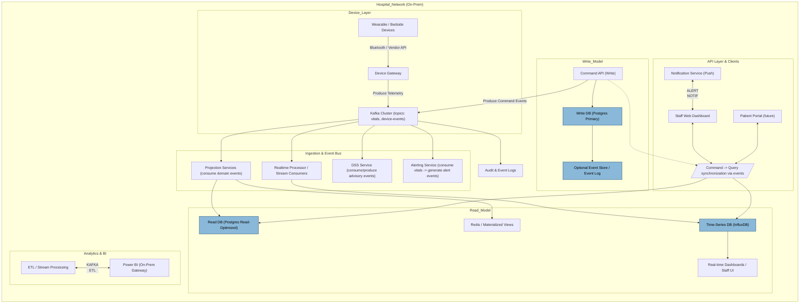
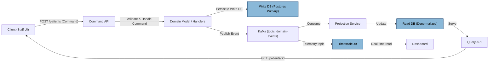
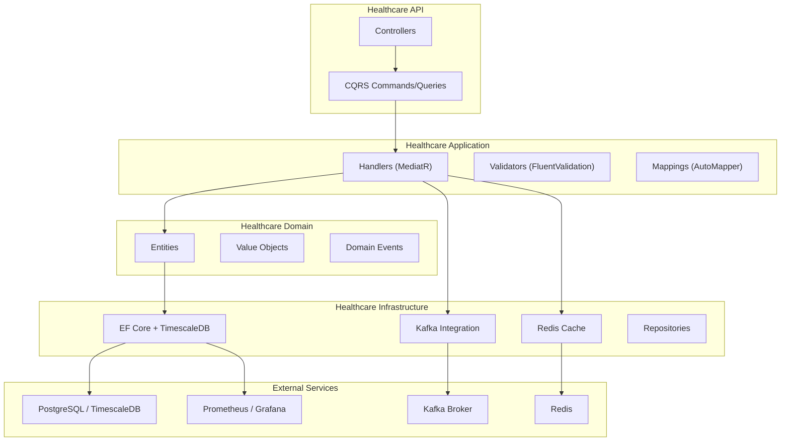

# Healthcare-platform

## Implementation order
### 🧭 Overall Strategy

**Start inside-out**: Core data, domain logic, and API first.

Then add intelligence (DSS) and analytics (reporting).

Finish with real-time ingestion (Kafka + TimescaleDB) when the rest is stable.

---

### 🏗️ Phase 1 — Core foundation (PMS + API + Auth)

**Goal**: Have a working Patient Management System with authentication and CRUD operations.

**Implement**:

#### Solution Structure & Setup
- Create the main solution with projects:
```graphql
HealthcareApp.sln
├── Healthcare.API → REST endpoints (CQRS Query/Command controllers)
├── Healthcare.Application → Use cases, CQRS handlers
├── Healthcare.Domain → Entities, value objects, events
├── Healthcare.Infrastructure → EF Core, Postgres persistence, repositories
├── Healthcare.Tests → Unit/integration tests
```

- Configure PostgreSQL as your main DB.
- Set up CQRS pattern with MediatR (or similar).

#### Authentication & Role-based Authorization
- Implement user and role tables.
- Use ASP.NET Core Identity or custom JWT auth.
- Define roles: doctor, nurse, admin, etc.

#### Patient Management System (PMS)
- Patient CRUD (demographics, contact info, history)
- Appointment scheduling & linking with doctors
- Treatment plan and notes
- Audit logging

#### Basic API & Swagger Docs
- REST endpoints for all PMS features.
- API versioning & error handling.

#### CI/CD Setup
- GitHub Actions or Azure DevOps for build/test pipeline.
- Dockerfile (optional for local containerization).

✅ **End of Phase 1 Result**:  
You have a working backend with patient management, authentication, and authorization — ready for frontend or Power BI to connect.

---

### 🧠 Phase 2 — Decision Support System (DSS)

**Goal**: Add clinical intelligence and advisory capabilities.

**Implement**:

#### DSS Service Layer
- Build within a new project: `Healthcare.DSS` or module in Application.
- Use domain events to trigger DSS checks (e.g., new diagnosis → suggest drug interaction review).

#### Rule Engine (start simple)
- Define static rule sets for:
- Drug contraindications
- Risk scoring
- Suggested guidelines (could be config-driven JSON or stored in DB)

#### Integration with PMS
- DSS suggestions appear in the patient’s dashboard or treatment view.
- Expose DSS endpoints via API.

#### Audit & Justification Logging
- Record what rules fired and when for transparency (important in healthcare).

✅ **End of Phase 2 Result**:  
You have smart decision support integrated into the PMS. All offline logic; no devices yet.

---

### 📊 Phase 3 — Reporting & Analytics (Power BI)

**Goal**: Add dashboards and reporting for clinical & operational metrics.

**Implement**:

#### Reporting Database (read model)
- Create CQRS “read” projections optimized for reporting (e.g., flattened views).
- May be in the same PostgreSQL instance or a separate DB.

#### Power BI Integration
- Expose the read model via REST API or direct DB access.
- Build dashboards for KPIs, operations, research.

#### Optional Caching with Redis
- Cache frequently accessed read queries for fast dashboard loading.

✅ **End of Phase 3 Result**:  
The hospital can visualize data and trends without needing live device feeds.

---

### ⚙️ Phase 4 — Real-time Monitoring (deferred IoT/devices)

**Goal**: Introduce streaming data & alerts.

**Implement**:

#### Event Streaming Backbone
- Add Kafka to your infrastructure.
- Define topics: `patient-vitals`, `alerts`, etc.

#### Telemetry Gateway Service
- Separate microservice (`Healthcare.TelemetryGateway`).
- Handles device data ingestion (mock data at first).
- Validates and publishes to Kafka.

#### TimescaleDB Integration
- Create hypertables for vitals.
- Consumers (read models) subscribe to Kafka and write to TimescaleDB.

#### Alerting Service
- Subscribes to Kafka and triggers threshold alerts (push/in-app).
- Persists notifications in PostgreSQL.

#### Frontend Real-Time Components
- WebSocket/SignalR endpoints for live dashboards.

✅ **End of Phase 4 Result**:  
You now have a real-time capable healthcare system supporting vitals monitoring, alerts, and analytics — full end-to-end.

---

### 🔒 Phase 5 — Hardening & Compliance

**Goal**: Prepare for production or pilot environments.

**Implement**:
- Security audit (TLS, logging, encryption)
- Load and integration tests
- Backup & retention policy
- Pseudonymization pipeline for analytics
- Documentation and user manuals

---

### 🗂️ Optional Phase 6 — Frontend / Patient Portal

Once the backend is stable:
- Build web dashboard (React/Vue/Angular).
- Add patient login to view data and messages.
- Add nurse/admin dashboards for alert management.

---

### 🧩 High-Level Timeline (Simplified)

| Phase | Focus                                  | Est. Priority   |
| ----- | -------------------------------------- | --------------- |
| 1     | Core PMS + Auth + CQRS setup          | 🔥 Critical     |
| 2     | DSS & rules                           | 🧠 Medium       |
| 3     | Analytics & Power BI                  | 📊 Medium       |
| 4     | Real-time IoT integration             | ⚙️ Deferred     |
| 5     | Hardening & security                  | 🔒 Required before production |
| 6     | Patient portal / frontend             | 🌐 Optional after backend stable |


## Architecture overview


---

## Event flow



---

## High-Level Architecture Diagram



---

## Tech Stack Overview
  
| Layer                       | Technology                                                    | Purpose / Notes                                                            |
| --------------------------- | ------------------------------------------------------------- | -------------------------------------------------------------------------- |
| **API Layer**               | **ASP.NET Core 8 (Web API)**                                  | Exposes REST endpoints, command/query endpoints (CQRS).                    |
| **Application Layer**       | **MediatR**, **FluentValidation**, **AutoMapper**             | CQRS handlers, input validation, mapping between DTOs and domain models.   |
| **Domain Layer**            | **Plain C# classes (Domain Entities, Value Objects, Aggregates)** | Core business logic, independent of frameworks.                            |
| **Infrastructure Layer**    | **Entity Framework Core**, **Npgsql**, **TimescaleDB**        | PostgreSQL database access, repository implementations, migrations.        |
| **Message Broker**          | **Apache Kafka**                                              | Event bus for domain and integration events (CQRS/Event Sourcing support). |
| **Telemetry / Time-Series** | **TimescaleDB (PostgreSQL extension)**                        | Stores device or time-series health data efficiently.                      |
| **Caching**                 | **Redis**                                                     | Caches queries, aggregates, or session data for performance.               |
| **Logging**                 | **Serilog**                                                   | Structured logging, writes to file, console, or Elasticsearch.             |
| **Monitoring**              | **Prometheus + Grafana**                                      | Metrics visualization and performance tracking.                            |
| **Containerization**        | **Docker / Docker Compose**                                   | Local environment setup and deployment consistency.                        |
| **Testing**                 | **xUnit + Moq**                                               | Unit, integration, and API testing.                                        |
